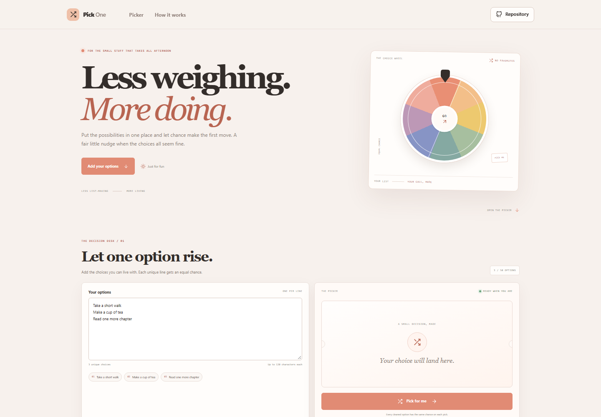



# Random Decision Picker

Give a short list of acceptable choices to the picker and let browser randomness make a fair first selection. It is a quick way to get unstuck on everyday, low-stakes decisions.

**Live app:** [https://a2rp.github.io/random-decision-picker/](https://a2rp.github.io/random-decision-picker/)

## Features

- Add up to 50 unique options, one per line, with a 120-character limit per choice.
- Ignores blank lines and collapses duplicate entries regardless of letter case.
- Selects one unique option at random; each remaining option has the same chance on every pick.
- Keeps the latest five picks in the current page session.
- Lets you edit or reset the sample list and clear recent picks.
- Responsive, keyboard-accessible controls and reduced-motion support.

## Use the picker

1. Edit the example list or enter your own choices, one per line.
2. Review the cleaned options and confirm they are all acceptable.
3. Select Pick for me. Choose Pick again if you want another draw.
4. Clear the list or refresh the page when finished.

## Privacy and limits

Your choices and recent picks stay in page memory and are not uploaded or saved by this project. Refreshing the page resets the session.

The picker uses Math.random for casual selection. It is not cryptographically secure, auditable, or suitable for lotteries, gambling, access control, or consequential decisions. It cannot weigh your priorities; only include options you would be comfortable choosing.

## Development

Requirements: Node.js and npm.

    npm install
    npm run dev

Run checks and build:

    npm test
    npm run lint
    npm run build

Deploy the production build:

    npm run deploy

## Future improvements

- Add optional weighted choices for everyday planning.
- Allow a shareable list link without storing the list on a server.
- Add more visual draw styles with a reduced-motion alternative.

## Links

- Portfolio: [https://www.ashishranjan.net](https://www.ashishranjan.net)
- GitHub: [https://github.com/a2rp](https://github.com/a2rp)
- CodePen: [https://codepen.io/ash1198](https://codepen.io/ash1198)
- LinkedIn: [https://www.linkedin.com/in/aashishranjan](https://www.linkedin.com/in/aashishranjan)
- Facebook: [https://www.facebook.com/theash.ashish/](https://www.facebook.com/theash.ashish/)
- YouTube: [https://www.youtube.com/@ashishranjan-ashz?sub_confirmation=1](https://www.youtube.com/@ashishranjan-ashz?sub_confirmation=1)
- Email: [mailto:ash.ranjan09@gmail.com](mailto:ash.ranjan09@gmail.com)

## Support

- Support: [https://a2rp-donation-page.netlify.app/](https://a2rp-donation-page.netlify.app/)
- Buy Me a Coffee: [https://buymeacoffee.com/ashishranjan](https://buymeacoffee.com/ashishranjan)
- Patreon: [https://www.patreon.com/ashishranjan](https://www.patreon.com/ashishranjan)
